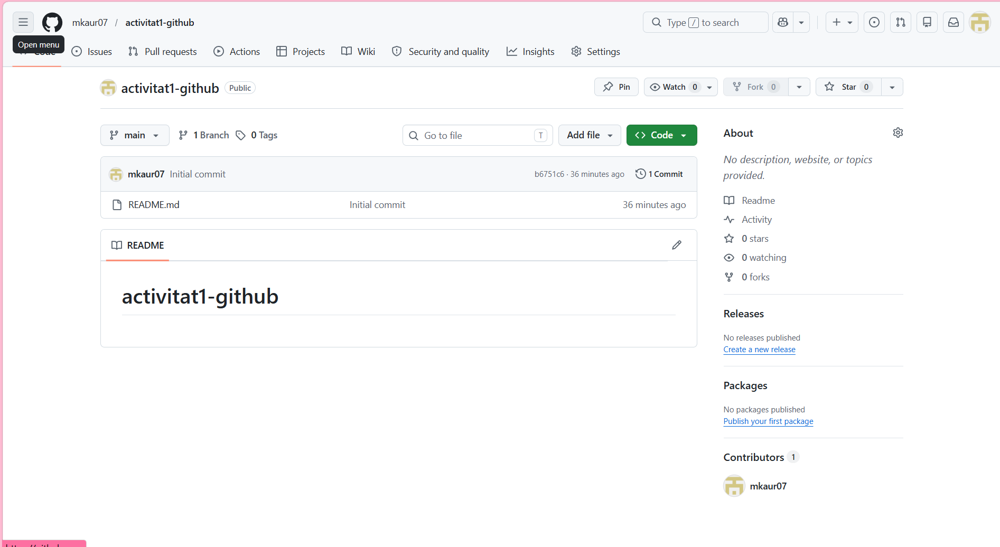

# Com he configurat el meu entorn de GitHub

Per començar amb aquesta activitat, el primer que he fet és crear-me un compte a **GitHub** per poder tenir tots els meus projectes al núvol. 

### Pas 1: Creació del repositori
He creat un repositori nou a la web i l'he configurat amb un fitxer README bàsic.

### Pas 2: Clonació amb GitHub Desktop
He clonat el repositori al meu ordinador (a la carpeta del meu usuari `manheer`). 

### Pas 3: Edició en Markdown
He creat aquests fitxers fent servir **Visual Studio Code**. M'ha resultat molt útil perquè l'editor em permet veure una previsualització de com quedarà el text final abans de pujar-lo.

### Pas 3: Pujar canvis
Ara desde la terminal fare un git commit per penjar el canvis al repsoitori
